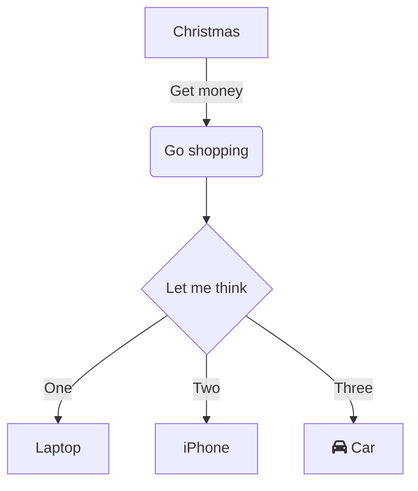
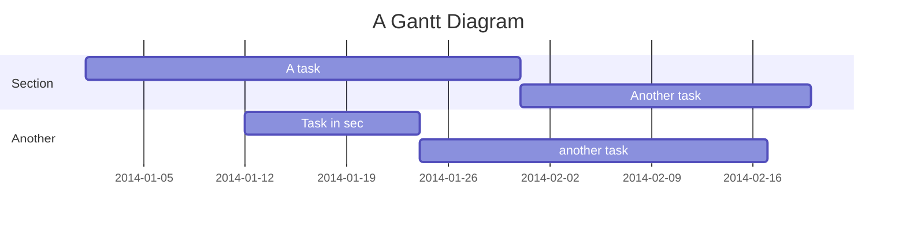
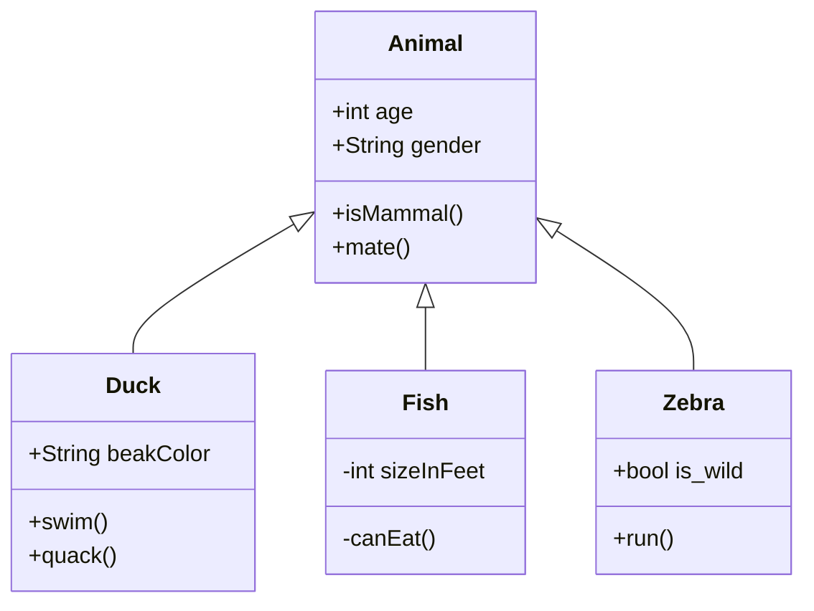
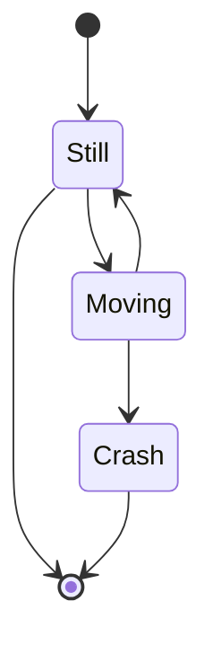
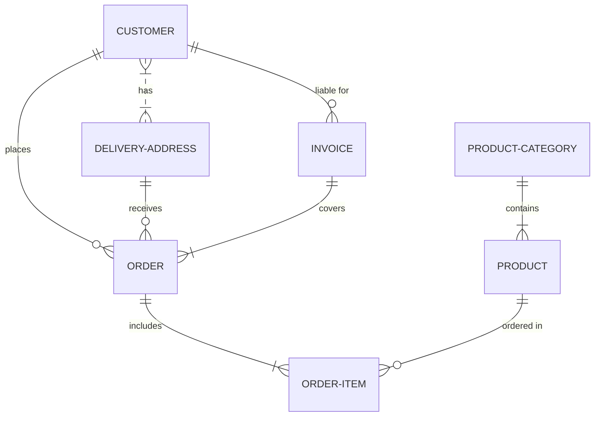
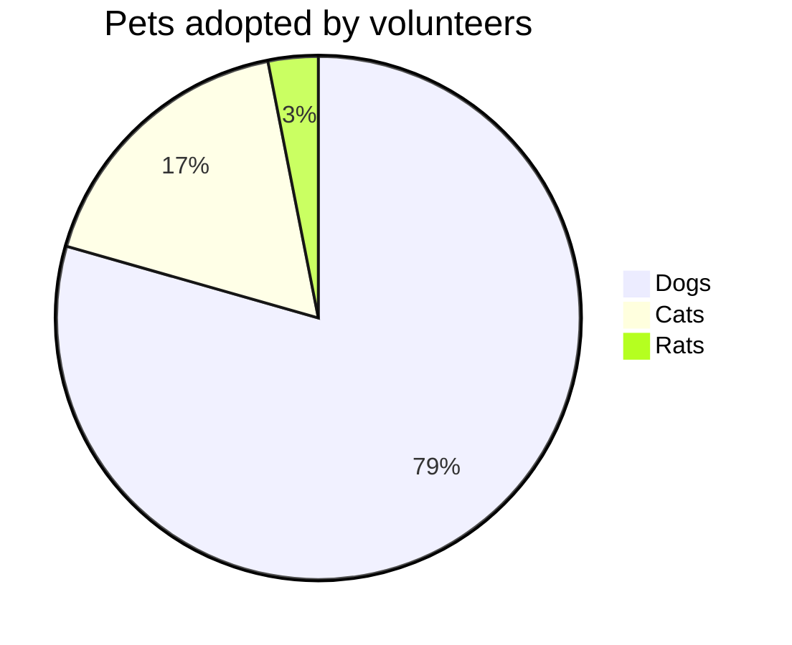
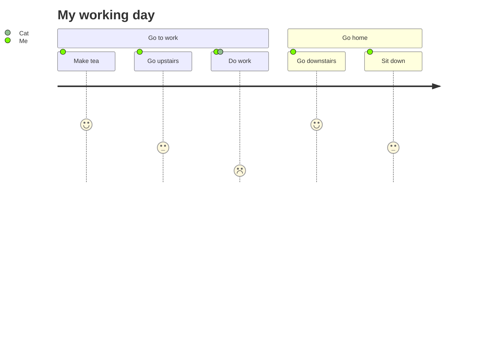
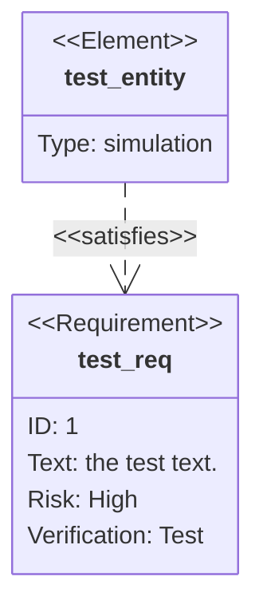
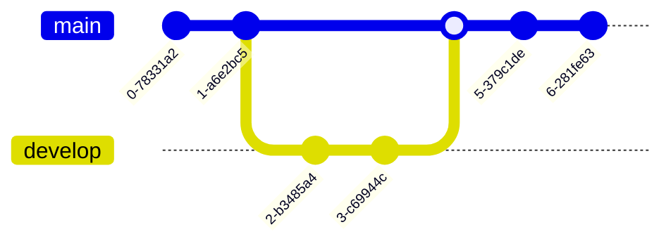

Mermaid.js is a powerful JavaScript-based tool for creating diagrams and visualizations using simple text descriptions. It allows you to dynamically render various types of diagrams directly from Markdown-inspired text definitions. Below, you’ll find descriptions and examples for different types of diagrams supported by Mermaid.js.

## Introduction

Here’s a refined and detailed explanation of the different types of diagrams you can create with Mermaid.js, including the syntax used for each Each type of Mermaid diagram is designed to fulfill specific needs in documentation and programming, providing an intuitive way to visualize complex information through simple text descriptions:

## Flowchart

Flowcharts are used to represent process flows or workflows. They show the sequence of steps in a process, helping to visualize the order and connections between tasks.

- `flowchart TD` specifies a top-down layout.
- Arrows (`-->`) indicate the direction of flow.
- `|Get money|` represents the label on the arrow.

## Gantt Chart

Gantt charts are used for project planning, displaying timelines and the progress of various tasks over time.

- `gantt` denotes the chart type.
- `dateFormat` sets the date format.
- `section` groups tasks into sections.
- Tasks are defined with a start date and duration.

## Class Diagram

Class diagrams represent the structure of classes in object-oriented programming, showing their attributes and methods.

- `classDiagram` specifies the diagram type.
- `Animal <|-- Duck` shows inheritance.
- Classes and their attributes/methods are defined within `class` blocks.

## State Diagram

State diagrams represent states and transitions of an entity, useful for modeling state changes in a system.

- `stateDiagram-v2` indicates the version.
- `[*]` represents the initial and final states.
- Transitions are shown with arrows.

## Entity Relationship Diagram (ERD)

ERDs show the relationships between entities in a database, useful for designing and understanding data structures.

- `erDiagram` specifies the diagram type.
- Relationships are denoted with different symbols (`}|..|{`, `||--o{`, etc.).

## Pie Chart

Pie charts represent data distribution in a circular format, showing the proportion of each category.

- `pie` specifies the diagram type.
- `title` sets the chart’s title.
- Categories and values are listed with their proportions.

## Journey

Journey diagrams represent the steps involved in a process or scenario, showing different stages and actions.

- `journey` specifies the diagram type.
- `section` groups stages of the journey.
- Actions are listed with their durations and participants.

## Requirement Diagram

Requirement diagrams represent system requirements and their relationships, useful for capturing and validating system needs.

- `requirementDiagram` indicates the diagram type.
- `requirement` and `element` define requirements and their properties.
- Relationships are shown with arrows.

## GitGraph

GitGraph diagrams visualize Git repositories and branches, helping to understand the branching and merging history.

- `gitGraph` specifies the diagram type.
- `commit` represents a commit in the graph.
- `branch`, `checkout`, and `merge` commands show branch operations.
