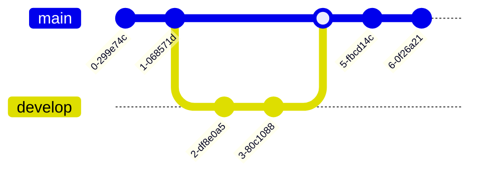

This Markdown cheat sheet provides a quick overview of all the Markdown syntax elements. It can’t cover every edge case, so if you need more information about any of these elements, refer to the reference guides for [basic syntax](https://www.markdownguide.org/basic-syntax/) and [extended syntax](https://www.markdownguide.org/extended-syntax/).

> 1. For generated `page.excerpt`, include the first paragraphs and/or avoid using comments after the front matter.
>
> 2. If using the inline attribute list `{: ... }` and it doesn't work as expected, see further [Attribute List Definitions](https://kramdown.gettalong.org/syntax.html#attribute-list-definitions).
{:.alert.alert-note .no-title}

<!-- markdownlint-disable MD022 MD025 MD033 MD036 -->

## Basic Features

### Headings

# Heading 1
{:.no_toc .no_anchor}

## Heading 2
{:.no_toc .no_anchor}

### Heading 3
{:.no_toc .no_anchor}

#### Heading 4
{:.no_toc .no_anchor}

##### Heading 5
{:.no_toc .no_anchor}

###### Heading 6
{:.no_toc .no_anchor}

### Paragraphs

Elit ex ex eiusmod duis cupidatat duis esse laboris et sit reprehenderit eu. Elit sint nostrud ex reprehenderit fugiat do elit anim veniam nulla veniam amet. Nisi velit deserunt sunt excepteur irure ut ipsum excepteur minim.

Et laborum minim elit laboris dolor in. Nisi sunt labore pariatur magna fugiat cupidatat qui quis consequat aliqua commodo. Dolor nisi veniam elit proident. Irure laboris tempor consectetur ad enim ea officia ullamco.

### Emphasis

**Bold text**

*Italicized text*

~~Strikethrough~~

### Lists

#### Ordered List

1. First item
2. Second item
3. Third item
   1. Indented item
   2. Indented item
4. Fourth item

#### Unordered List

- First item
- Second item
- Third item
  - Indented item
    - Indented item
- Fourth item

#### Definition List

First Term
: This is the definition of the first term.

Second Term
: This is one definition of the second term.
: This is another definition of the second term.

#### Task/Todo List

- [x] Write the press release
- [x] Update the website
- [ ] Contact the media

### Links

<https://jekyllrb.com>

Free **[Palestine](https://www.google.com/search?q=free+palestine)**.

### Blockquotes

> Words can be like X-rays, if you use them properly—they’ll go through anything. You read and you’re pierced.
>
> —Aldous Huxley, <cite>Brave New World</cite>
{: cite="<https://www.huxley.net/bnw/four.html>" }

### Codes

**Sample output**: <samp>This is sample output from a computer program.</samp>

**Keyboard input**: <kbd>Ctrl</kbd> + <kbd>Shift</kbd> + <kbd>Esc</kbd>

**Inline code**: `{"firstName": "John","lastName": "Smith","age": 25}`

**Block code**:

```plaintext
{
  "firstName": "John",
  "lastName": "Smith",
  "age": 25
}
```

### Footnotes

Here's a simple footnote,[^1] and here's a longer one.[^bignote]

[^1]: This is the first footnote.
[^bignote]: Here's one with multiple paragraphs and code.

    Indent paragraphs to include them in the footnote.

    `{ my code }`

    Add as many paragraphs as you like.

### Tables

Table with [Github Flavored Markdown](https://docs.github.com/en/get-started/writing-on-github/getting-started-with-writing-and-formatting-on-github/about-writing-and-formatting-on-github):

| Column 1 | Column 2 | Column 3 |
| -------- | :------: | -------: |
| Cell 1   |  Cell 1  |   Cell 1 |
| Cell 2   |  Cell 2  |   Cell 2 |
| Cell 3   |  Cell 3  |   Cell 3 |
| Cell 4   |  Cell 4  |   Cell 4 |

Table with HTML tag elements:

<table>
  <caption>
    A summary of the UK's most famous punk bands
  </caption>
  <thead>
    <tr>
      <th scope="col">Band</th>
      <th scope="col">Year Formed</th>
      <th scope="col">No. of Albums</th>
      <th scope="col">Most Famous Song</th>
    </tr>
  </thead>
  <tbody>
    <tr>
      <th scope="row">Buzzcocks</th>
      <td>1976</td>
      <td>9</td>
      <td>Ever Fallen in Love (with Someone You Shouldn't've)</td>
    </tr>
    <tr>
      <th scope="row">The Clash</th>
      <td>1976</td>
      <td>6</td>
      <td>London Calling</td>
    </tr>
    <tr>
      <th scope="row">The Stranglers</th>
      <td>1974</td>
      <td>17</td>
      <td>No More Heroes</td>
    </tr>
    <tr>
      <th scope="row">The Stranglers</th>
      <td>1974</td>
      <td>17</td>
      <td>No More Heroes</td>
    </tr>
  </tbody>
  <tfoot>
    <tr>
      <th scope="row" colspan="2">Total Albums</th>
      <td colspan="2">49</td>
    </tr>
  </tfoot>
</table>

### Horizontal Rule

---

### Images

#### Image to center

Do sit commodo fugiat irure sit cillum laboris ut mollit consectetur pariatur sint. Cupidatat quis irure aliqua aliqua labore ex ad dolor. {:.img.center width='280'} Veniam quis ad esse pariatur sit ipsum adipisicing laboris eu pariatur. Veniam sint nisi ad veniam laborum voluptate. Esse irure incididunt sint officia fugiat nulla velit ut laborum amet laborum.

#### Float to left

{:.img.left width='180'} Labore do pariatur labore labore Lorem occaecat nulla. Non do adipisicing est officia et. Dolore ullamco laboris est commodo laborum magna ut amet ad dolor ipsum anim aliquip consectetur. Cupidatat culpa in quis ea quis dolor amet velit minim.

#### Float to right

{:.img.right width='256'} Enim voluptate ullamco amet ipsum qui incididunt aliqua culpa cillum commodo aliqua. Incididunt Lorem consequat elit tempor officia sunt incididunt Lorem nulla minim excepteur duis consequat. Ullamco eiusmod ex consectetur fugiat dolore laboris nulla dolor. Consequat esse cupidatat sunt sit proident consequat officia sit. In enim ea tempor laborum. Dolor laboris esse ad consectetur minim ut velit non ipsum minim labore.

## Extended Features

### Code Blocks

This is a code block with syntax highlighting:

```json
{
  "thisSyntax": error,
  "firstName": "John",
  "lastName": "Smith",
  "age": 25
}
```

For more syntax highlighting see: [Rouge Highlighting]()
{: .alert.alert-note }

### Admonitions

Alerts or admonitions are frequently used in documentation to draw attention to warnings, notes, and other important information. The example below is adapted from [GitHub Flavored Markdown](https://github.com/orgs/community/discussions/16925){: target="_blank" }.

Default:

> General information or also for Blockquote alternatives.
{:.alert}

Note:

> Highlights information that users should consider, even when skimming.
{:.alert.alert-note}

Tip:

> Optional information to help a user be more successful.
{:.alert.alert-tip}

Important:

> Crucial information necessary for users to succeed.
{:.alert.alert-important}

Warning:

> Critical content requiring immediate user attention due to potential risks.
{:.alert.alert-warning}

Caution:

> Potential negative consequences of an action.
{:.alert.alert-caution}

### Diagramming

Diagramming and charting powered by [Mermaid](https://mermaid.js.org/):



For more Mermaid syntax see: [Mermaid Diagram]()
{: .alert.alert-note }

### Mathematics

**Inline formula**: $$a^2 + b^2 = c^2$$.

**Block formula**:

$$
c = \pm\sqrt{a^2 + b^2}
$$

### Other elements

**Abbreviation**: *[HTML]: Hyper Text Markup Language The HTML specification is maintained by the W3C.

**Marked**: <mark>very important words</mark>.

**Subscript**: C<sub>8</sub>H<sub>10</sub>N<sub>4</sub>O<sub>2</sub>

**Superscript**: <var>E</var>=<var>m</var><var>c</var><sup>2</sup>.

### Emoji Shortcodes

If you see **:raised_hand:** as an emoji like this ✋ it means Emoji Shortcode is enable by plugin, otherwise open terminal and run the command below:

```bash
# Add plugin to Gemfile
echo 'gem "jemoji", group:jekyll_plugins' >> Gemfile

# Install plugin
bundle install

# Test on local
bundle exec jekyll serve --watch
```

In most cases, you can simply copy an emoji from a source like [Emojipedia](https://emojipedia.org/) or [EmojiCopy](https://emojicopy.com/) then paste it into your document.
{:.alert.alert-tip }

<!-- *This is the result of footnotes* -->

<!-- A footnote will be displayed automatically after this line. -->
